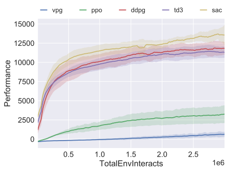
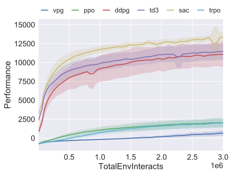
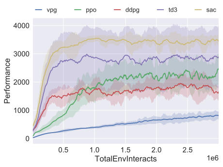
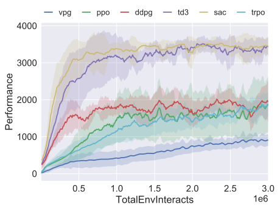
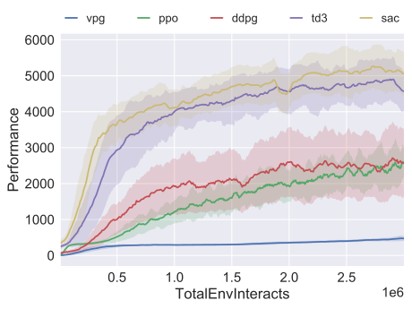
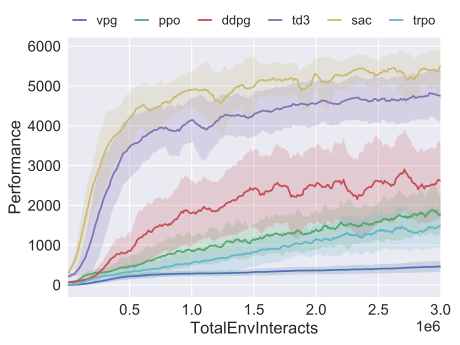
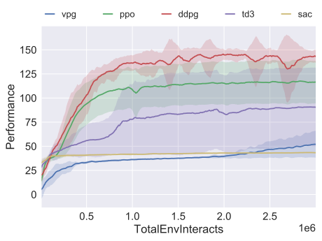
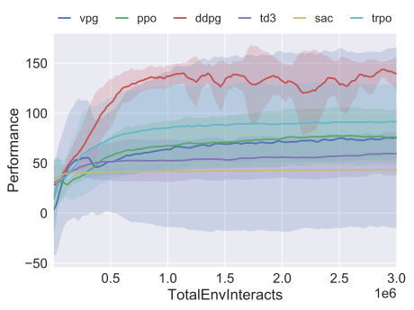
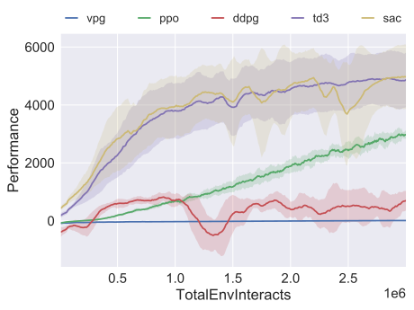
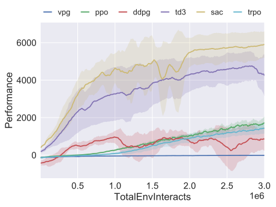

==========================================
Benchmarks for Spinning Up Implementations
==========================================

.. contents:: Table of Contents

We benchmarked the Spinning Up algorithm implementations in five environments from the MuJoCo_ Gym task suite: HalfCheetah, Hopper, Walker2d, Swimmer, and Ant.

.. _MuJoCo: https://gym.openai.com/envs/#mujoco

Performance in Each Environment
===============================

HalfCheetah: PyTorch Versions
-----------------------------

    3M timestep benchmark for HalfCheetah-v3 using **PyTorch** implementations.

HalfCheetah: Tensorflow Versions
--------------------------------

    3M timestep benchmark for HalfCheetah-v3 using **Tensorflow** implementations.

Hopper: PyTorch Versions
------------------------

    3M timestep benchmark for Hopper-v3 using **PyTorch** implementations.

Hopper: Tensorflow Versions
---------------------------

    3M timestep benchmark for Hopper-v3 using **Tensorflow** implementations.

Walker2d: PyTorch Versions
--------------------------

    3M timestep benchmark for Walker2d-v3 using **PyTorch** implementations.

Walker2d: Tensorflow Versions
-----------------------------

    3M timestep benchmark for Walker2d-v3 using **Tensorflow** implementations.

Swimmer: PyTorch Versions
-------------------------

    3M timestep benchmark for Swimmer-v3 using **PyTorch** implementations.

Swimmer: Tensorflow Versions
----------------------------

    3M timestep benchmark for Swimmer-v3 using **Tensorflow** implementations.

Ant: PyTorch Versions
------------------------

    3M timestep benchmark for Ant-v3 using **PyTorch** implementations.

Ant: Tensorflow Versions
---------------------------

    3M timestep benchmark for Ant-v3 using **Tensorflow** implementations.

Experiment Details
==================

**Random seeds.** All experiments were run for 10 random seeds each. Graphs show the average (solid line) and std dev (shaded) of performance over random seed over the course of training.

**Performance metric.** Performance for the on-policy algorithms is measured as the average trajectory return across the batch collected at each epoch. Performance for the off-policy algorithms is measured once every 10,000 steps by running the deterministic policy (or, in the case of SAC, the mean policy) without action noise for ten trajectories, and reporting the average return over those test trajectories.

**Network architectures.** The on-policy algorithms use networks of size (64, 32) with tanh units for both the policy and the value function. The off-policy algorithms use networks of size (256, 256) with relu units.

**Batch size.** The on-policy algorithms collected 4000 steps of agent-environment interaction per batch update. The off-policy algorithms used minibatches of size 100 at each gradient descent step.

All other hyperparameters are left at default settings for the Spinning Up implementations. See algorithm pages for details.

Learning curves are smoothed by averaging over a window of 11 epochs.

.. admonition:: You Should Know

    By comparison to the literature, the Spinning Up implementations of DDPG, TD3, and SAC are roughly at-parity with the best reported results for these algorithms. As a result, you can use the Spinning Up implementations of these algorithms for research purposes.

    The Spinning Up implementations of VPG, TRPO, and PPO are overall a bit weaker than the best reported results for these algorithms. This is due to the absence of some standard tricks (such as observation normalization and normalized value regression targets) from our implementations. For research comparisons, you should use the implementations of TRPO or PPO from `OpenAI Baselines`_.

.. _`OpenAI Baselines`: https://github.com/openai/baselines

PyTorch vs Tensorflow
=====================

We provide graphs for head-to-head comparisons between the PyTorch and Tensorflow implementations of each algorithm at the following pages:

* `VPG Head-to-Head`_

* `PPO Head-to-Head`_

* `DDPG Head-to-Head`_

* `TD3 Head-to-Head`_

* `SAC Head-to-Head`_

.. _`VPG Head-to-Head`: ../spinningup/bench_vpg.html
.. _`PPO Head-to-Head`: ../spinningup/bench_ppo.html
.. _`DDPG Head-to-Head`: ../spinningup/bench_ddpg.html
.. _`TD3 Head-to-Head`: ../spinningup/bench_td3.html
.. _`SAC Head-to-Head`: ../spinningup/bench_sac.html